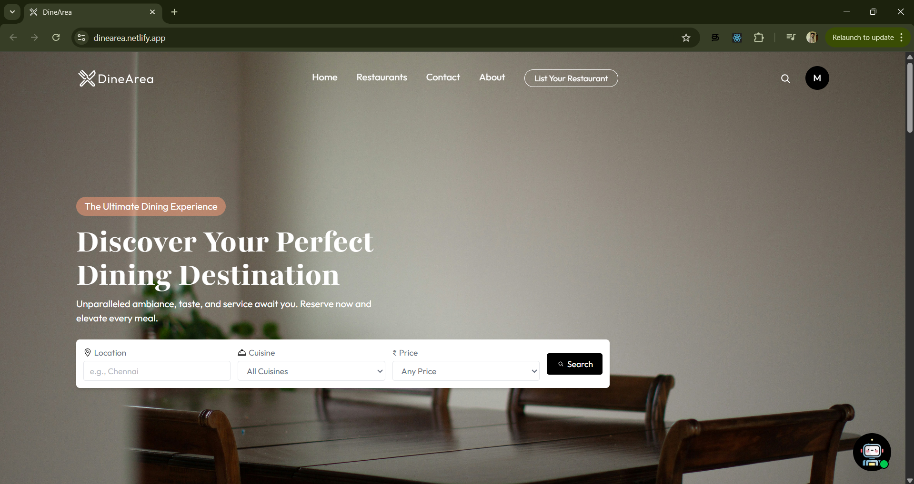
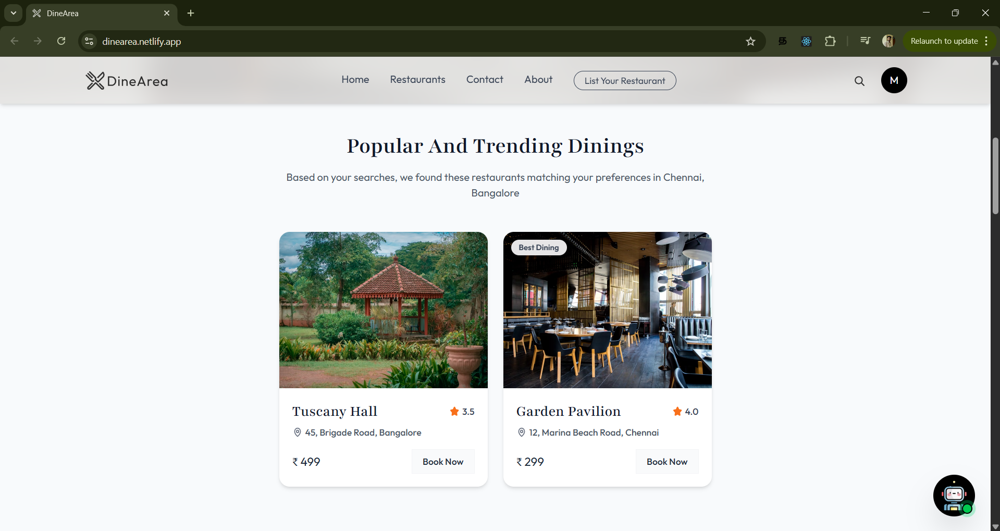
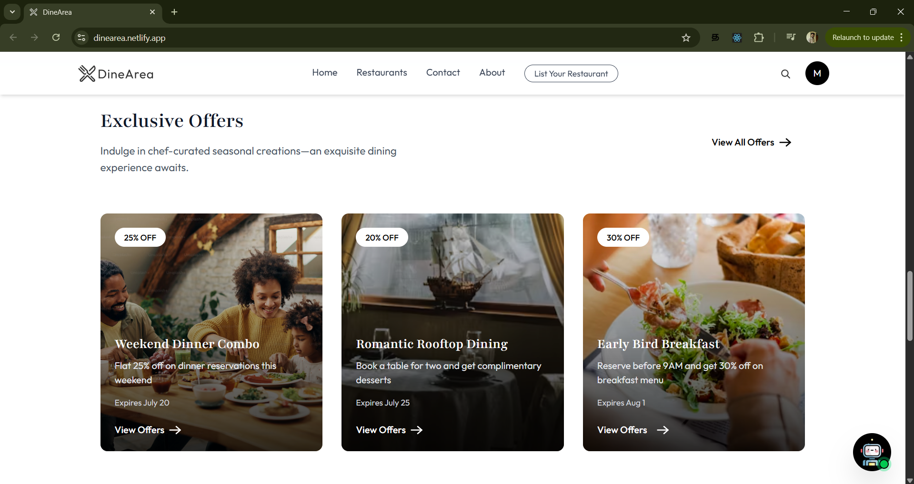
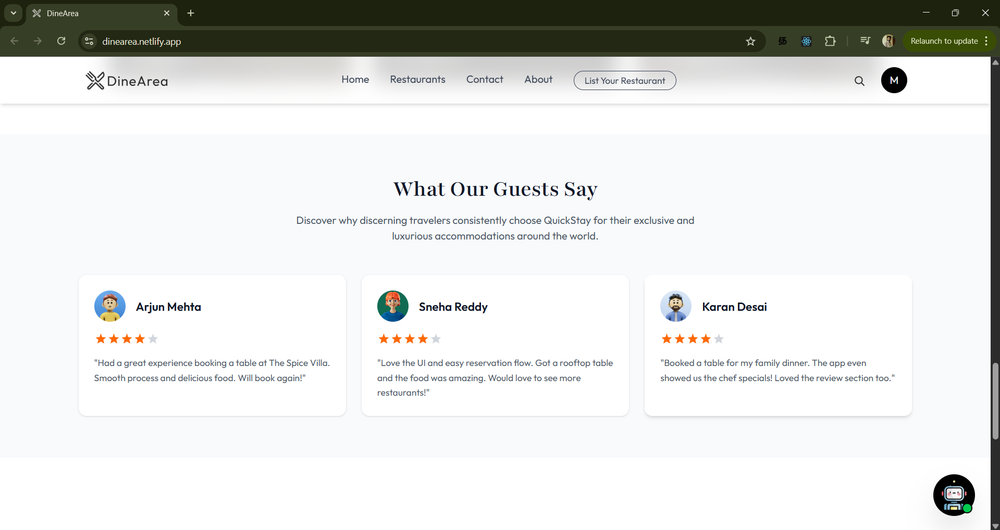
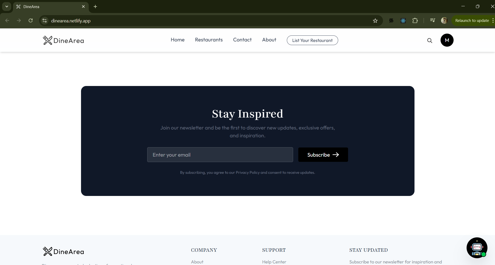
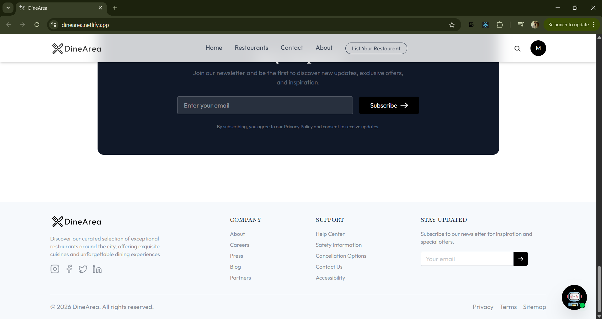

# 🍽️ DineArea – Premium Restaurant Reservation Platform

[](https://reactjs.org/)
[](https://tailwindcss.com/)
[](https://nodejs.org/)
[](https://www.mongodb.com/)
[](https://stripe.com/)

DineArea is a modern, full-stack restaurant reservation platform designed for seamless booking experiences. It features a robust real-time AI assistant, secure multi-stage payment processing via Stripe, and a comprehensive management dashboard for restaurant owners. Built with the **MERN** stack and styled with the latest **Tailwind CSS 4**, it offers performance, scalability, and a premium user interface.

---

## ✨ Features

### 🏢 For Customers
- **Intuitive Discovery:** Search and filter restaurants by cuisine, location, and dining areas.
- **Smart Booking:** Real-time table availability with instant confirmation.
- **AI Concierge:** 24/7 AI Assistant to help with recommendations and booking queries.
- **Secure Payments:** Integrated Stripe checkout with automated receipt generation.
- **Personalized Experience:** Track reservation history, manage profiles, and leave detailed reviews.

### 👨‍🍳 For Restaurant Owners
- **Dynamic Dashboard:** Manage listings, update menus, and track incoming bookings in real-time.
- **Dining Area Control:** Define multiple seating zones with specific capacities.
- **Media Management:** Professional-grade image uploads powered by Cloudinary.
- **Reservation Lifecycle:** Automated status updates from "Pending" to "Completed".

---

## 🛠️ Tech Stack

### Frontend
- **Framework:** React 19 (Vite)
- **Styling:** Tailwind CSS 4.0
- **Routing:** React Router 7
- **State Management:** React Context API
- **Feedback:** React Hot Toast & React Toastify
- **Communication:** Socket.io-client & Axios

### Backend
- **Core:** Node.js & Express 5 (Next-gen Express)
- **Real-time:** Socket.io
- **Database:** MongoDB with Mongoose ODM
- **Security:** JWT Authentication & Bcrypt hashing
- **AI Integration:** OpenRouter (OpenAI Models)
- **Media:** Cloudinary SDK

### Tools & Infrastructure
- **Payments:** Stripe API
- **Emails:** SendGrid API
- **Storage:** Multer (with Cloudinary Storage)
- **Unique IDs:** UUID

---

## 🏗️ Architecture Overview

The project follows a modular **MVC (Model-View-Controller)** architecture on the backend to ensure clean separation of concerns:
- **Models:** Define the data schema (Users, Restaurants, Reservations, etc.).
- **Controllers:** Handle business logic and request processing.
- **Routes:** Map endpoints to specific controller functions.
- **Middlewares:** Handle authentication (JWT), file parsing (Multer), and error handling.
- **Services:** External integrations like Stripe, Cloudinary, and AI.

On the **Frontend**, a component-based architecture is utilized with functional components and hooks, ensuring a highly responsive and maintainable codebase.

---

## ⚙️ Installation & Setup

### 1. Clone the Repository
```bash
git clone https://github.com/SGMohan/Restaurant-Reservation-Platform.git
cd Restaurant-Reservation-Platform
```

### 2. Environment Configuration
Create a `.env` file in both the `/Server` and `/Client` directories.

**Server (.env)**
```env
PORT=3000
MONGO_URI=your_mongodb_connection_string
JWT_SECRET=your_jwt_secret
CLOUDINARY_CLOUD_NAME=your_cloud_name
CLOUDINARY_API_KEY=your_api_key
CLOUDINARY_API_SECRET=your_api_secret
STRIPE_SECRET_KEY=your_stripe_secret
OPENROUTER_API_KEY=your_openrouter_key
SENDGRID_API_KEY=your_sendgrid_key
FRONTEND_URL=http://localhost:5173
```

**Client (.env)**
```env
VITE_BACKEND_URL=http://localhost:3000
VITE_CURRENCY=₹
STRIPE_PUBLISHABLE_KEY=your_publishable_key
```

### 3. Install Dependencies
```bash
# Install Server dependencies
cd Server
npm install

# Install Client dependencies
cd ../Client
npm install
```

### 4. Run the Application
```bash
# Start Backend (from /Server)
npm run dev

# Start Frontend (from /Client in a new terminal)
npm run dev
```

---

## 🔌 API Endpoints

### Authentication
| Method | Endpoint | Description |
| :--- | :--- | :--- |
| `POST` | `/auth/register` | Register a new user |
| `POST` | `/auth/login` | Authenticate user & get token |

### Restaurants
| Method | Endpoint | Description |
| :--- | :--- | :--- |
| `GET` | `/restaurants` | List all restaurants |
| `GET` | `/restaurants/:id` | Get restaurant details |
| `POST` | `/restaurants` | Create new restaurant (Owner) |

### Reservations
| Method | Endpoint | Description |
| :--- | :--- | :--- |
| `POST` | `/reservation` | Create a new table booking |
| `GET` | `/reservation` | Fetch user/owner reservations |
| `POST` | `/reservation/stripe-webhook` | Secure payment verification |

---

## 📂 Folder Structure

```text
.
├── Client/                 # React frontend (Vite + Tailwind 4)
│   ├── src/
│   │   ├── components/     # Reusable UI parts
│   │   ├── pages/          # View components
│   │   ├── context/        # Global state
│   │   └── assets/         # Styles and images
│   └── .env                # Client configuration
├── Server/                 # Express backend
│   ├── controller/         # Request handlers
│   ├── model/              # Database schemas
│   ├── config/             # DB & Cloudinary config
│   ├── middleware/         # Auth & validation
│   └── service/            # AI & Payment logic
├── .gitignore
└── README.md
```

---

## 📸 Screenshots / Demo

> [!TIP]
> Live Demo available at: **[DineArea Web](https://dinearea.netlify.app)**

<div align="center">
  
  
  <br />
  
  
  <br />
  
  
  <br />
  
</div>

---

## 🔮 Future Improvements
- [ ] **Push Notifications:** Real-time mobile alerts for booking updates.
- [ ] **Waitlist Management:** Automated queue system during peak hours.
- [ ] **Loyalty Program:** Reward points for repeated bookings.
- [ ] **Multi-provider Login:** Google and Apple ID authentication.

---

## 🤝 Contributing
Contributions are welcome! Please feel free to submit a Pull Request.
1. Fork the Project
2. Create your Feature Branch (`git checkout -b feature/AmazingFeature`)
3. Commit your Changes (`git commit -m 'Add some AmazingFeature'`)
4. Push to the Branch (`git push origin feature/AmazingFeature`)
5. Open a Pull Request

---

## 🌐 Deployed Project URLs

- **Frontend (Netlify):** [https://dinearea.netlify.app/](https://dinearea.netlify.app/)
- **Backend (Render):** [https://restaurant-reservation-platform.onrender.com](https://restaurant-reservation-platform.onrender.com)

---

## 📜 License
Distributed under the **MIT License**. See `LICENSE` for more information.

---
*Built with ❤️ for a better dining experience.*
